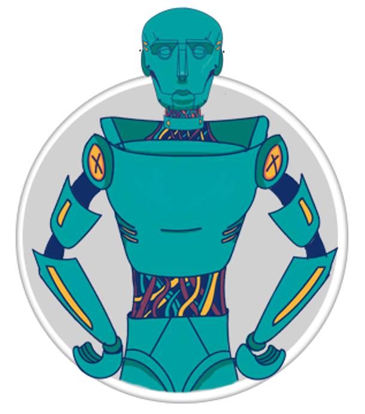

  

    
  

  

    
  

## Documentação

### Using Rasa  

Nós usamos o Rasa 1.3.1, que é um framework para treinar e fazer deploy de bots escritos em markdown e python.
PS: Versões futuras do bot precisam ser testadas.

Voce pode encontrar informações do rasa em:
  https://rasa.com/ 
  https://rasa.com/docs/
  https://rasa.com/docs/rasa/  

## Installation

#### Quick Install

A plataforma utiliza o docker para criar um ambiente virtual linux em uma porta e rodar a aplicação.

##### Requirements
   - Docker version 18.09.7
      https://docs.docker.com/install/linux/docker-ce/ubuntu/

         sudo apt-get install docker-ce=<VERSION_STRING> docker-ce-cli=<VERSION_STRING> containerd.io

   - Docker Compose version 1.24
     https://docs.docker.com/compose/install/

         sudo curl -L "https://github.com/docker/compose/releases/download/1.24.3/  docker-compose-$(uname -s)-$(uname -m)" -o /usr/local/bin/docker-compose´
  
   - PS: Usar distribuição linux porque ainda não temos suporte para windows (chupa windows)    

#### Build Aplication

Clone o repositorio na sua maquina local e complia o repositorio com o docker:
Ao final da instalação o server estara em IP:8080. (Pode ser acessado por outros devices na mesma rede)

        git clone https://github.com/Julianepmello/virtual-assistant.git

        cd virtual-assistant
    
        docker-compose build
    
        docker-compose up  

PS:
A aplicação vai instalar o python, npm, rasa e criar ambientes virtuais.
Tenha paciência e acompanhe os logs para verificar possiveis problemas.

#### Installation

   Instalação detalhada: [this link](docs/installation/Readme.md)

## Usage
  -  Uso : [click here](docs/usage/Readme.md)
  -  Informações: [About project](docs/Readme.md)

## License

[Apache 2.0](LICENSE)
